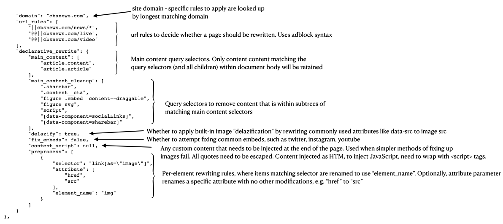

# Brave SpeedReader

This repository contains tooling to package frequently updated content rewriting rules as an extension, delviered to the browser using the built-in Component Updater. It verifies that the configuration matches defined schema.

## Development

It is highly recommended to check that the proposed rules actually achieve the intended effect in the browser. Brave accepts a command line parameter specifying the location of rewriting configuration in the local filesystem:

```bash
$BRAVE_PATH --enable-speedreader \
    --enable-logging=stderr --v=0 --vmodule="*speedreader*=3" \
    --speedreader-whitelist-path="$SPEEDREADER_REPO_PATH/data/SpeedReaderConfig.json"
```

## Rule Syntax



## Help

How do I enable SpeedReader in Brave: https://support.brave.com/hc/en-us/articles/360045031392-How-Do-I-Enable-SpeedReader-

How do I request a new site to be added: [File a GitHub issue](https://github.com/brave-experiments/SpeedReader/issues/new?assignees=&labels=&template=new-site-request.md&title=New+site+request%3A+...)

How do I report an issue with page rewriting: [File a GitHub issue](https://github.com/brave-experiments/SpeedReader/issues/new?assignees=&labels=&template=content-rewriting-problem.md&title=Content+rewriting+error+on+...)

_Note: SpeedReader implementation has been moved to https://github.com/brave/brave-core/tree/master/components/speedreader_
